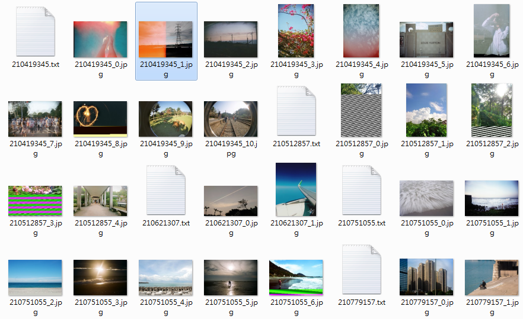

# Dcard Crawler

這是一個用來抓取 [Dcard][1] 上公開資料的 Java 程式。

## 功能

- 可以用來下載 Dcard 指定版面的文章，並可以給予多項條件
- 可以下載文章中所包含的圖片 (不含留言中的圖片)

## 環境需求

- Java Runtime Environment 1.7+
- 文字輸入介面 (Command Line Terminal)

## 使用方式

此程式的執行方法如下：

```
java -jar dcard-crawler.jar [動作] [選項] [參數]
```

此程式必須先指定要進行的**動作**，這個時候針對不同的動作就會有更進一步的指示。可以使用的動作有：
- `fetch-post` - 下載文章
- `fetch-image` - 下載已經存在電腦中的文章包含的圖片

或者也可以使用 `-v` 來印出版本編號。

以下針對這些動作一一介紹。

### 下載文章

對於 `fetch-post` 這個動作的具體執行方法如下：

```
java -jar dcard-crawler.jar fetch-post [選項] [下載文章數目] [存檔路徑]
```

其中`下載文章數目`控制要下載多少文章，`存檔路徑`則是指定文章存放的位置，可以是絕對也可以是相對路徑。若存檔資料夾中已經有之前下載過的文章，那麼程式會自動跳過存在的文章。使用者可以透過選項自行指定是否要重新下載存在的文章。特別注意若使用者指定重新下載，那麼預設會把重新下載的文章也列入`下載文章數目`的計算。該設定可以透過`-d`選項忽略。

可以使用的選項有：

```
-b,--before-id <post id>    從指定文章編號之前開始下載
-r,--redownload-exsiting    重新下載已經下載過的文章
-d,--dont-count-redowns     下載計算不包含重新下載的文章
-e,--ex-no-img-posts        不要下載不含圖片的文章
-f,--forum <forum alias>    指定討論版 (必須使用別名)
-g,--gender <M|F>           指定作者性別 (M=男生, F=女生)
-v,--version                顯示程式版本號碼
```

可以使用的討論版別名如下：

```
ALL, BOOK, ACG, GAME, CCC, FUNNY, BG, TREADING, TALK, GIRL, BOY,
MOOD, MUSIC, TRAVEL, PHOTOGRAPHY, MOVIE, HOROSCOPES, LITERATURE, SPORT,
PET, FOOD, HANDICRAFTS, JOB, STUDYABROAD, MARVEL, FRESHMAN, COURSE,
EXAM, SEX, DCARD, WHYSOSERIOUS;
```

### 下載文章中的圖片

對於 `fetch-post` 這個動作的具體執行方法如下：

```
java -jar dcard-crawler.jar fetch-image [選項] [文章資料夾路徑] [圖片存檔路徑]
```

此指令會從已經下載下來的文章中，找出圖片網址，並將圖片下載下來。使用者必須在`文章資料夾路徑`指定文章的資料夾，並透過`圖片存檔路徑`指定圖片存放位置。

可以使用的選項有：

```
-v,--version                顯示程式版本號碼
```

## 執行範例

假設我今天想下載攝影版 (`-f PHOTOGRAPHY`) 前 10 篇包含圖片 (`-e`) 的文章到我的資料夾 `photos`，可以這樣執行：

```
java -jar dcard-crawler.jar fetch-post -e -f PHOTOGRAPHY 10 photos
```

執行期間大概會看到這些資訊：

```
五月 22, 2016 6:52:49 下午 slmt.crawler.dcard.downloader.DcardPostDownloader <init>
資訊: creates a new directory at photos
五月 22, 2016 6:52:49 下午 slmt.crawler.dcard.downloader.DcardPostDownloader setTargetForum
資訊: only download the posts in forum: PHOTOGRAPHY
五月 22, 2016 6:52:49 下午 slmt.crawler.dcard.downloader.DcardPostDownloader onlyWithImage
資訊: only download the posts with images: true
五月 22, 2016 6:52:49 下午 slmt.crawler.dcard.downloader.DcardPostDownloader downloadPosts
資訊: retrieving the list of first 30 posts of PHOTOGRAPHY forum
五月 22, 2016 6:52:56 下午 slmt.crawler.dcard.downloader.DcardPostDownloader downloadPosts
資訊: 5 posts have been downloaded. (0 posts are re-downloaded.)
五月 22, 2016 6:53:01 下午 slmt.crawler.dcard.downloader.DcardPostDownloader downloadPosts
資訊: 10 posts have been downloaded. (0 posts are re-downloaded.)
```

執行完畢後就可以在 `photos` 資料夾找到下載下來的文章。

若想要進一步下載圖片，可以再接著使用以下指令：

```
java -jar dcard-crawler.jar fetch-image photos photos
```

執行過程大概會看到以下資訊：

```
五月 22, 2016 6:54:11 下午 slmt.crawler.dcard.downloader.ImageDownloader downloadImages
資訊: downloading images in 224065441.txt
五月 22, 2016 6:54:30 下午 slmt.crawler.dcard.downloader.ImageDownloader downloadImages
資訊: finishes downloading for 224065441.txt
五月 22, 2016 6:54:30 下午 slmt.crawler.dcard.downloader.ImageDownloader downloadImages
資訊: downloading images in 224065465.txt
五月 22, 2016 6:54:31 下午 slmt.crawler.dcard.downloader.ImageDownloader downloadImages
資訊: finishes downloading for 224065465.txt
五月 22, 2016 6:54:31 下午 slmt.crawler.dcard.downloader.ImageDownloader downloadImages
資訊: downloading images in 224065528.txt
五月 22, 2016 6:54:31 下午 slmt.crawler.dcard.downloader.ImageDownloader downloadImages
資訊: finishes downloading for 224065528.txt
五月 22, 2016 6:54:31 下午 slmt.crawler.dcard.downloader.ImageDownloader downloadImages
資訊: downloading images in 224065643.txt
五月 22, 2016 6:54:32 下午 slmt.crawler.dcard.downloader.ImageDownloader downloadImages
資訊: finishes downloading for 224065643.txt

(省略)
```

下載結束之後，`photos` 資料夾內應該有這些檔案 (沒有全部列出)：



文字檔像是 `210419345.txt` 即為文章，數字為 Dcard 文章編號。圖片則是文章內的附圖，檔名則為 Dcard 文章編號加上一個序號。

## 部分程式碼尚未整理

這份程式碼原本是為了我個人研究用途所撰寫的，因此部分程式碼尚未整理。目前只開放部分功能供大家使用。

## 程式碼相依性

此程式編譯需要以下 library，這些都已經寫入 Maven 的 `pom.xml` 之中，理論上可以直接用 Maven 編譯。

- [Apache Commons CLI][2] - 1.3.1
  - 用來解析 command line options
- [Apache Commons Logging][3] - 1.2.0
  - 用來記錄一些資訊
- [Alibaba Fastjson][4] - 1.2.4
  - 用來解析 JSON

公布的 Jar 檔則已經包含這些程式庫。

## TODOs

- 將之前留下的程式碼轉換為可以使用的功能
  - CSV 下載器 (主要是為了能夠存進 database)
  - 簽名檔計數器
- 下載下來的文章可以用 HTML 的格式存，這樣打開可以直接看到圖片
- 增加一個 action 來同時進行抓取文章與圖片
- 聲音檔下載器
- GUI (應該不太可能做，不過還是寫一下)

[1]: https://www.dcard.tw/
[2]: https://commons.apache.org/proper/commons-cli/
[3]: https://commons.apache.org/proper/commons-logging/
[4]: https://github.com/alibaba/fastjson
